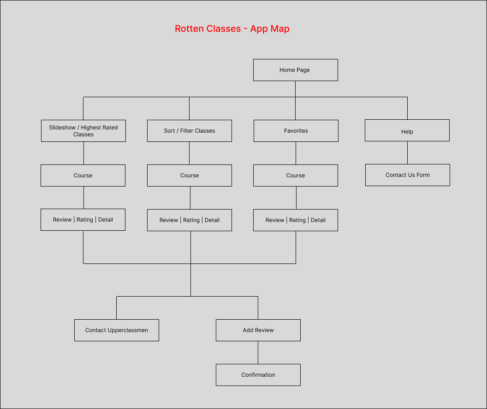
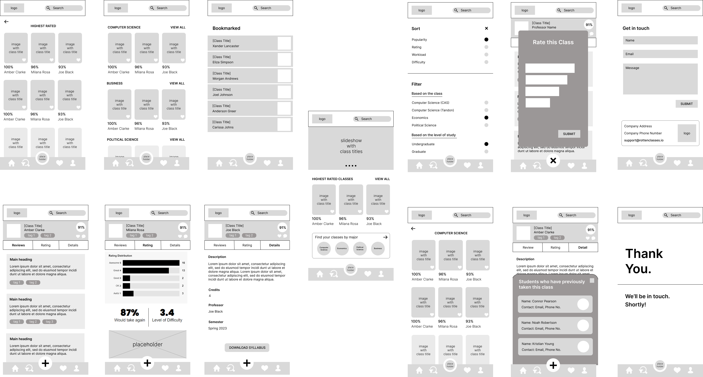

# User Experience Design

## App Map

The main Home Screen of the app contains navigation options to five different screens:
- Home : has a search bar, navigation bar at the bottom, displays the highest-rated classes and provides a direct way to view classes by major.
- Sort / Filter Classes
- Add Review (pop-up box to add the review / rating)
- Favorites / Bookmarked Classes : to come back and view the shortlisted classes later
- Help / Contact Us

Every course page has a rating, review and detail sections separately with a feature to get the contact details of upperclassmen who have taken the particular class previously.

## Wireframe

This is the wireframe displaying all the screens (HOME screen at the center).

### Wireframe (Individual Screens)

#### HOME Screen

This screen has a search bar, navigation bar at the bottom, displays the highest-rated classes and provides a direct way to view classes by major.
Every class has a rating (represented by a percentage).

#### SORT / FILTER Screen

#### COURSE Screen - Contains 3 tabs (Review, Rating, Detail)

#### ADD A REVIEW Screen

#### FAVORITES / BOOKMARK Screen - Contains list of classes that the user has shortlisted

It has a swipe functionality to delete the shortlisted class!

#### CONTACT UPPERCLASSMEN Screen - Contains students who have taken the particular class previously

#### CONTACT US Screen

#### THANK YOU Screen - After submitting the contact us form

This repository contains instructions and files for two assignments that together comprise the user experience design phase of a web app.

Replace the contents of this file with the completed assignments, as described in:

- [app map & wireframe instructions](instructions-0a-app-map-wireframes.md).
- [prototype instructions](instructions-0b-prototyping.md)
